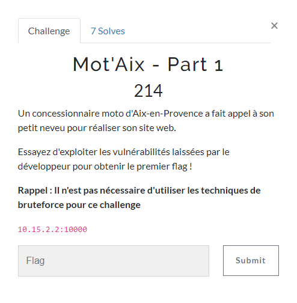

# MOT'AIX

<div align="center">
  <a href="https://hackynov.fr"></a>
</div>

----

## Contexte

Lorsque l’on lance notre challenge, nous arrivons sur le site d’un concessionnaire de moto « Mot’Aix ».


Le but va être de trouver une faille LFI (Local File Inclusion) afin de récupérer notre premier flag, puis d’avoir un contrôle Shell à distance pour parcourir le serveur et récupérer notre deuxième flag (RCE).

## Partie 1 : LFI



| Nom du challenge  | Catégorie     | Nombre de points | Nombre de résolution |
|-------------------|---------------|------------------|----------------------|
| Mot'Aix Part 1    | Web           |        214       |         7/11         |

Afin de trouver les pages qui nous permettront d’utiliser la faille LFI, nous devons regarder le fichier **« robots.txt »** qui se trouve à la racine de notre serveur. Ce type de fichier permet d’indiquer une liste des ressources du site qui ne sont pas censés être indexés par les robots d’indexation des moteurs de recherche.


On remarque qu’on a des pages dans un dossier **« admin »** qui sont susceptibles d’être vulnérables à une faille LFI : le paramètre GET **« page »** appelle un fichier php (sûrement pour l’include).
On voit également qu’on a accès à un fichier de log au chemin suivant : __« /admin/access.log »__. On garde ça en mémoire, ça pourrait servir 😉.


Si on va sur la page __dashborad.php__, on tombe sur notre première barrière : Un formulaire d’authentification. La solution est simple, les propriétaires ont laissé la configuration par défaut, on peut donc se connecter avec la simple combinaison **root:root**.


On est maintenant connecté sur le Dashboard Administrateur du site de la concession. On a accès à certaines pages dont une : « Flag »


Le Flag est sur cette page :


On va devoir utiliser un filtre via l’URL pour récupérer le code source de la page :


Le filtre est le suivant :


Il suffit désormais de décoder la chaîne en Base64 pour regarder le code source :


FLAG : **HACKYNOV{V1v3L35filtr3s!}**

----

## Partie 2 : RCE


| Nom du challenge  | Catégorie     | Nombre de points | Nombre de résolution |
|-------------------|---------------|------------------|----------------------|
| Mot'Aix Part 2    | Web           |        300       |         6/11         |

L’objectif est de trouver un moyen d’accéder au serveur et d’y récupérer notre Flag.
Si l’on se souvient bien, dans notre « robots.txt » était inscrit un chemin pour accéder au fichier de log : **/admin/access.log**

Il nous suffit de l’inclure dans notre page « dashboard.php » grâce au paramètre GET « page » et de tester d’exécuter du code php avec l’option « -A » de curl et d’y rajouter un paramètre « cmd » pour exécuter des commandes via l’url.


La commande curl : On affiche une chaine « HACKYNOV » juste pour se repérer dans le fichier de log et on affiche le résultat de notre commande juste après :
```
cur -A "<?php echo 'HACKYNOV              ';system(\$_GET['cmd']);?>" 10.15.2.2:10000
```

On retrouve bien notre chaîne de caractère dans le fichier de log :


----
> :warning: **Pour des besoins organisationnels lors de l'évènement, le fichier de log est 'refresh' toute les 15 secondes**
----

Test de la commande « whoami » :


On voit qu’on arrive à exécuter nos commandes, il nous reste plus qu’à chercher et afficher notre flag :


FLAG : **HACKYNOV{V1v3L35filtr3sK&N!}**